    
    <h1 align="center" style="color:crimson">Sebastian Mora</h1>
    <h3 align="center">Data Scientist 👨‍🔬 | Data Engineer 🔜 | Data Analyst 📊</h3>

## 💫 About Me:
*Electronic engineer & Database specialist* with a deep fascination for the world of data. My journey in the realm of technology has led me to explore various facets of data. **As an aspiring data scientist, data engineer and data analyst, I am committed to harnessing the power of data to drive innovation and solve real-world problems**. With a strong foundation in electronics and a burning curiosity for data-driven insights, I am constantly seeking new challenges and opportunities to merge my engineering skills with the limitless possibilities of data science.
- [Portfolio](https://jseb99.github.io/portfolio/)

  <h3 align="left">🌐 Socials:</h3>
  
  
  

---

## 🔨Languages and Tools</h3>

## 📊 GitHub Stats

  
  

---

## 📌 Repo Destacado

